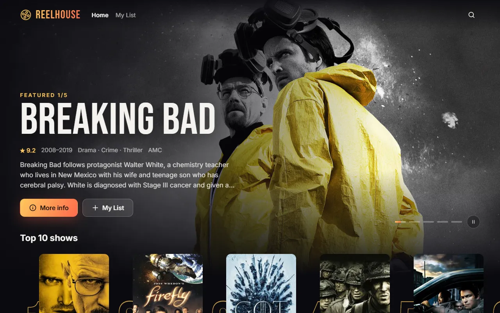

# Reelhouse

A streaming-style browser for real TV shows: a rotating billboard, scrolling rows by genre, a Top 10, a details view with cast and every season's episodes, search, and a watch list. Built on the free [TVmaze API](https://www.tvmaze.com/api), so there is no key and nothing to sign up for.

**Live:** https://jeevan2410.github.io/Netflix-Clone/



## Features

- **Billboard** cycling the five best-rated shows, with a slow camera push on each backdrop, text that rises in line by line, progress dots and a pause button. It pauses on hover, while a details panel is open, and when the tab is hidden.
- **Rows** for the Top 10 (with big outlined numbers), critically acclaimed shows and genres. Posters fan in as each row scrolls into view, lift and tilt toward the pointer, and reveal title, rating and years.
- **Details** for any show: backdrop, poster, rating, years, runtime, network, genres, summary, cast, and episodes by season. Where the browser supports View Transitions, the clicked poster flies into the panel.
- **Search** as you type, **My List** saved in the browser, and links that work: `#show/169` opens Breaking Bad directly and the back button closes it.
- Keyboard friendly, labelled controls, and `prefers-reduced-motion` respected.

## How it works

Plain HTML, CSS and ES modules, with no build step. Hosted on GitHub Pages.

| File | Job |
|---|---|
| `src/api.js` | TVmaze requests: the catalogue (two pages, about 500 shows, cached for the session), details in one request, search |
| `src/catalog.js` | Pure logic: shaping and ranking shows, rows, routes, My List, turning HTML summaries into plain text |
| `src/main.js` | Rendering, billboard, details panel, search, routing and pointer motion |

TVmaze summaries arrive as HTML. They are reduced to plain text and every piece of show data is set with `textContent`, and images are only loaded from TVmaze's image host.

This started as a copy of a streaming service's sign-up page. It is now an original design with its own name, and it uses real, openly licensed show data instead of another company's logo and artwork.

## Run it

Serve the folder with any static server, for example:

```bash
npx serve .
```

Tests use Node's built-in runner (Node 20+):

```bash
npm test
```

## Credits

Show data and images from [TVmaze](https://www.tvmaze.com/), licensed CC BY-SA. Reelhouse is a demo and does not stream anything.
